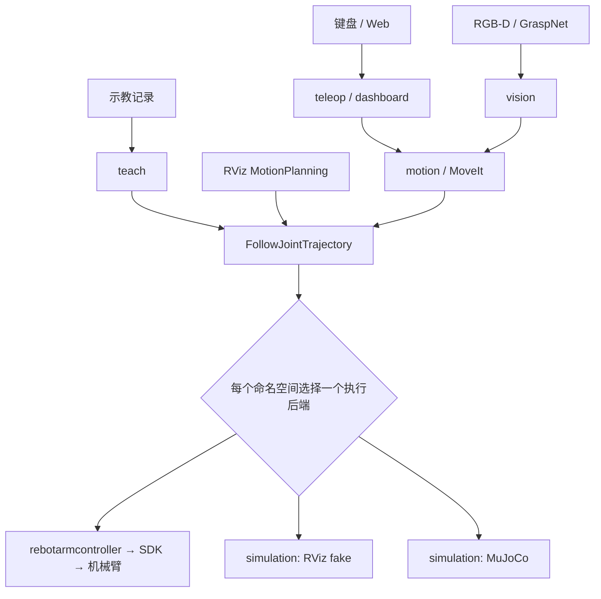

# 项目架构与依赖边界

维护基线：2026-09-11，五项边界迁移后。本文约束当前 **13 个 ROS 包**；[项目阶段](project_stage_zh.md)记录完成程度，[验收依据](acceptance_criteria_zh.md)定义怎样证明完成。新增 `rebotarm_description`；语音包继续排除在当前范围之外。验证与兼容性变更见[迁移记录](acceptance_records/2026-09-11-boundary-migration.md)。

## 1. 系统边界

项目以六轴机械臂、夹爪、MoveIt、RGB-D 视觉和仿真为核心。ROS 接口隔开业务目标与执行后端，Python 包依赖隔开算法与应用。二者不能混为一张依赖图：通过 Action 调用控制器，不代表可以导入控制器内部实现。

下面是运行时命令流，不是 Python import 关系：



夹爪、停止、使能和状态还有独立 ROS 接口。`bringup` 组装这些节点；`msgs` 定义公共类型；`calibration` 提供标定计算；`moveit_config` 提供规划配置。Real2Sim 的数据方向是真机状态 → 仿真，不是第二个真机命令源。

## 2. 包职责与代码归属

表中依赖只列**允许的项目内 Python 导入**，不代表每项当前都有 import；ROS 标准消息及第三方计算库另行声明。资源和 launch 依赖见下一节。

| 包 | 负责的内容 / 主要入口 | 不应放入的内容 | 允许导入的项目包 |
| --- | --- | --- | --- |
| `rebotarm_msgs` | 公共 msg/srv/action；单位、字段、状态协议 | SDK、算法、配置加载、业务状态机 | 无 |
| `rebotarm_calibration` | 手眼配置校验、刚体变换、TCP 求解与残差 | 相机采集、机器人运动、任务执行 | 无 |
| `rebotarm_description` | 唯一 URDF、mesh、共用电机身份和标称参数 | ROS 节点、SDK、部署编排与运行安全策略 | 无 |
| `rebotarmcontroller` | 真机连接、总线所有权、反馈、仲裁、轨迹执行、夹爪、关闭；`reBotArmController` | MoveIt 规划、网页、视觉任务、示教文件工作流 | `msgs` |
| `rebotarm_motion` | 通用规划适配、预览、重定时、碰撞预检、起点对齐、失败恢复；`PoseExecutionNode` | Web 页面、任务识别、硬件通信 | `msgs` |
| `rebotarm_teach` | JSONL 记录、质量分析、prepared trajectory、回放会话；`TeachRecorderNode` / `TeachReplayNode` | 复制通用重定时算法、网页、SDK | `motion`、`msgs` |
| `rebotarm_teleop` | 键盘/Web 命令转换、夹爪显示状态桥；`TeleopKeyboardNode` | 页面渲染、录制文件存储、底层运动控制 | `motion`、`msgs` |
| `rebotarm_dashboard` | HTTP、SSE、页面和 ROS 客户端；`TeleopStatusPanelNode` | IK、碰撞算法、示教轨迹准备算法、SDK | `motion`、`msgs`、`teach`、`teleop` |
| `rebotarm_vision` | 本机 RGB-D、ROS YOLO/GraspNet 节点、候选筛选及抓取状态机 | Windows/HTTP 正式链路、电机命令、复制标定/通用轨迹算法 | `calibration`、`motion`、`msgs` |
| `rebotarm_simulation` | MuJoCo 核心、RViz fake、ROS 适配、Real2Sim、任务环境与离线验收 | 真机 SDK、向真机发运动命令、Web 业务 | `msgs` |
| `rebotarm_moveit_config` | URDF/SRDF、规划组、IK/OMPL、控制器映射、MoveIt 演示 launch | 业务执行算法、硬件通信 | 无 |
| `rebotarm_bringup` | 场景 launch、运行/安全/交互配置与 RViz；`core.launch.py` 及场景包装入口 | 物理模型副本、轨迹/视觉/示教算法、SDK 初始化实现 | 无；通过 launch 组合其他包 |
| `rebotarm_interactive_control` | 历史导入/入口的薄转发 | 资源配置、新业务实现 | `motion`、`msgs`、`teach`、`teleop`、`dashboard` |

缩写 `msgs` 等均指 `rebotarm_` 前缀的包。真机控制器的实际包名是 `rebotarmcontroller`。

旧 `PosePreviewSolver` 及其兼容导入路径已经退休，预览/规划统一使用 MoveIt。控制器内置 `InternalTeachRecorder` 已删除，录制服务与 JSONL 写入只由 `rebotarm_teach` 提供。Dashboard 不发布机械臂或夹爪执行反馈；仿真操作同样必须连接执行后端。

仓库外层边界：

| 路径 | 维护责任 | 集成限制 |
| --- | --- | --- |
| `tools/`、`patches/`、`rebotarm_dependencies.repos` | 开发工具、第三方版本与可复现补丁 | 不作为 ROS 业务模块的 import 来源 |
| `models/MANIFEST.sha256` | 模型权重身份与校验 | 权重可用、推理可用、抓取成功分别验收 |
| `star_arm_102_rebot_b601_follow/` | 独立 SDK 主从跟随工具 | 不在主 launch 中启动；不得与 ROS 控制器争用同一设备 |
| `tests/` | 当前回归测试 | 只统计工作区中实际存在且执行过的测试 |
| `docs/acceptance_records/` | 版本、配置、试验与结果证据 | 历史记录不得冒充当前版本验收 |

## 3. 三类依赖分别管理

1. **代码依赖**：Python import。只能按照职责表向下引用；底层不能反向导入 Dashboard、任务包或兼容包。业务层不得导入 MotorBridge/硬件 SDK。
2. **安装与资源依赖**：`package.xml`、launch 的 `Node(package=...)`、包 share 查找和 `package://` 模型路径。直接使用必须直接声明，不能依赖“整个工作区刚好都已安装”。
3. **运行时协议依赖**：Topic/Service/Action。调用者负责超时、拒绝、取消和失败处理；接口存在不等于对应 server 已实现，也不等于三个后端实现了全部相同能力。

当前代码 import、包声明以及已识别资源依赖图均无环，资源方向为：

```text
bringup → moveit_config / simulation / dashboard / teach / teleop / vision / controller
bringup / moveit_config / simulation / dashboard → description
dashboard → moveit_config（规划速度限制）
moveit_config → teleop（夹爪显示桥）
interactive_control → 正式实现包（单向兼容转发）
```

模型和共用电机配置已从 bringup 移到 description；MoveIt 的重复 URDF 已删除，两个规划入口都读取 description 的同一文件。交互配置已从兼容包移至 bringup，正式包不再反向依赖兼容包。四条旧资源例外和 SDK 例外均已清零，规则见 [architecture_rules.json](../tools/architecture_rules.json)。

## 4. 关键运行时契约

默认机械臂命名空间为 `/rebotarm`。以下是维护边界，不是所有接口的穷举。

| 契约 | 提供方 / 使用方 | 验收重点 |
| --- | --- | --- |
| `/rebotarm/follow_joint_trajectory`，标准 `FollowJointTrajectory` | 控制器或仿真后端；MoveIt、motion、teach 消费 | 只能有一个 server；关节名称、时间、拒绝、取消、最终状态一致 |
| `/rebotarm/joint_states`，`JointState` | 选中的执行后端；规划、记录、显示消费 | 不混用真实与 fake 状态；名称、单位、时间戳可追溯 |
| `/rebotarm/arm_status` | 真机控制器；任务/面板消费 | 连接、使能、运动许可、错误不能混为一项；fake/MuJoCo 不应被假定具有全部硬件状态 |
| `/rebotarm/motion_execution/execute_pose`，`ExecutePose` | motion；视觉等消费 | 基于反馈规划，规划失败不能落入直接 SDK 运动 |
| `/rebotarm/trajectory_stop`，`Trigger` | 控制器/仿真后端 | 请求与实际停止结果分开记录；停止不等于失能或物理急停 |
| `/rebotarm/gripper/set`，`SetGripper` | 控制器/仿真后端 | 以米表示总开度；真机命令范围 `0–0.085 m` |
| `/rebotarm/teleop/teach_record/start`、`stop`、`set_path` | 仅 teach | 应用组合中只启动一个录制节点；状态和文件由同一提供方管理 |
| `/rebotarm/visual_grasp/execute`、`stop`，`Trigger` | vision | 无新鲜有效计划时拒绝；一次只执行一个抓取流程 |

`MoveRelative.action` / `ExecuteGrasp.action` 是已存在的共享协议定义；语音包删除后继续保留接口文件，不应将它们宣传为已可用的任务 Action server。

录制启动归属：`rebotarm_app` 通过 `core` 的 `start_teach_recorder=true` 开启一个空闲录制节点；`teleop_system` 自己启动一个录制节点并关闭子入口的录制开关；普通 RViz、core、driver_only 默认不启动录制。独立终端录制搭配 driver/core 使用，不与已开启录制服务的完整 app 叠加。每个命名空间只选择一个组合入口。

Dashboard 的真机夹爪仍调用 `GripperCommand` Action；仿真夹爪调用后端 `SetGripper` 服务。后端缺失返回 unavailable，响应失败返回 failed；提交请求不等于完成。`/gripper/state` 始终由选中的执行后端发布，网页不能用目标位置伪造反馈。

视觉正式链在 Ubuntu 上由三个节点通信：相机发布同帧注册/去畸变的 Image 和设备 CameraInfo，YOLO 发布保留图像 header 的检测/分割，GraspNet 精确同步这些 ROS 消息并保留采集时间。推理封装属于 vision 包，不能从 tools 导入运行实现。候选坐标使用深度光学坐标，过滤阶段按采集时刻取 TF；ArUco 标定也订阅相同 ROS 数据。协议和部署见[本机 ROS 视觉路线](local_ros_vision_zh.md)。

Open3D 查看器作为可选的第四个只读节点，订阅同帧 RGB-D、CameraInfo 和原始候选，在独立进程显示点云/夹爪示意并保存快照；它不拥有采集、推理或运动接口。旧 Windows/HTTP 工具链已删除，`tools/yolo26s-seg.pt` 作为本机共用权重保留。

### 运行模式不能互相替代验收

| 场景 | 当前入口 | 证明范围 |
| --- | --- | --- |
| 模型显示 | `rviz.launch.py` | 模型与 TF 显示，不提供动力学证据 |
| RViz 操作仿真 | `rviz_ee_drag_sim.launch.py` | MoveIt + 一个 fake trajectory controller，验证交互/接线 |
| MuJoCo | simulation 的 `mujoco_sim.launch.py` | 单独启动物理仿真 ROS 后端；MoveIt 需另外组合 |
| 真机 RViz | `rviz_ee_drag_real.launch.py` | 启动/Plan 不使能，合法 Execute 按需使能并执行 |
| Real2Sim | simulation 的 `real2sim_bridge.launch.py` | 只读真机状态的镜像，不证明真机轨迹执行 |

真机 RViz 的按需使能由 `enable_on_trajectory=true` 控制；其他入口默认 `false`。控制器无法判断 Action 请求是否来自 RViz，所有连接到该接口的客户端都受同一策略影响。退出时 `shutdown_safe_home=false` 仅取消自动回安全位，关闭流程仍尝试失能，不能解释为继续保持力矩。

不同入口的默认值必须逐项审查，不能把 `hardware_mode` 当作所有历史 launch 的统一防护开关。`driver_only`、传统 `bringup` 等可直接启动真机节点。详细入口见 [launch 说明](../src/rebotarm_bringup/launch/README.md)。

## 5. 配置和模型的归属

| 当前文件 | 责任方 | 修改后的联动验证 |
| --- | --- | --- |
| description `config/arm.yaml`、`gripper.yaml` | 真机/仿真共用电机配置 | 电机身份、方向、零点、SDK 加载、仿真读取；现场通道可由 launch 覆盖 |
| bringup `config/controller_safety.yaml` | 执行边界 | 轨迹/反馈/夹爪单元测试及实机停止、失败恢复 |
| bringup `config/controller_runtime.yaml`、`rviz_real.yaml` | 部署默认值 | 启动模式、使能策略、退出行为 |
| description `description/urdf/`、`description/meshes/` | 唯一维护的 URDF 与 mesh 来源 | TF、关节范围、末端坐标、mesh 安装路径、MuJoCo 一致性 |
| moveit_config 的 SRDF、`joint_limits.yaml`、`moveit_controllers.yaml` | 规划配置 | 规划组、碰撞、控制器接线；规划范围不能放宽执行边界 |
| bringup `config/interactive_control.yaml`、`teleop_control.yaml` | 交互/示教部署配置 | 所有包装 launch 的配置路径和参数覆盖 |
| vision `config/handeye.yaml` 及视觉策略配置 | 感知/任务 | 设备、日期、TF 方向、TCP、残差、新鲜度、桌面约束 |
| simulation `models/`、`config/` | 仿真 | 数值稳定、接触、任务成功率、模型与硬件差异 |

配置应注明单位、默认值、来源和适用模式。URDF 已收敛为单一来源；MuJoCo 的 MJCF/场景和 assets 仍是独立运行需要的生成资产，模型变更后需要重新生成/验证，不能由 URDF 单一来源推断仿真和实机已经一致。

## 6. 架构债务与迁移顺序

| 编号 | 现状与影响 | 下一步与退出证据 |
| --- | --- | --- |
| ARCH-01 已关闭 | 共享模型/电机参数已迁至 description，直接依赖已补齐 | 新 build/install 的 13 包构建、安装资源测试、严格图检查通过 |
| ARCH-02 已关闭 | 兼容配置已迁到 bringup，正式入口不再依赖兼容包 | 包装 launch 组合和安装路径回归通过；兼容导入仍保留 |
| ARCH-03 已关闭 | 无当前运行消费者的 SDK 预览类及兼容 shim 已退休 | SDK 例外清空；MoveIt 读取共享 URDF 的 launch 构造检查通过 |
| ARCH-04 | fake 夹爪默认最大开度 `0.09 m`，真机为 `0.085 m`；后端接口覆盖不完全一致 | S2：统一共享契约或明确能力差异；加入开度、取消、拒绝和状态的跨后端测试，不能靠 fake 成功替代真机边界 |
| ARCH-05 | 原有大量测试已在当前工作区删除；现有通过数覆盖范围有限 | S1/S2：按验收矩阵补齐关键回归或迁移等价测试，每项绑定新证据；不能引用已删除测试文件作为保障 |
| ARCH-06 已关闭 | 控制器内置录制已移除，teach 成为唯一实现 | 各应用组合的录制节点数、单帧去重和录制状态门槛回归通过 |
| ARCH-07 已关闭 | Dashboard 不再产生执行反馈，仿真夹爪调用后端 | 无后端、待响应、成功/失败、断连及真机 Action 保持回归通过 |
| ARCH-08 已关闭 | 补齐直接 ROS/常用 Python 与 launch 依赖 | 外部依赖检查纳入严格门禁；新构建目录构建通过 |

本次五项迁移已完成代码和自动验证闭环。后续优先补齐 ARCH-05 的安全回归及 ARCH-04 的后端契约差异。暂不建立空的“通用工具包”或任务框架；只有出现明确跨包复用与稳定接口后再拆分。

## 7. 日常维护门禁

```bash
python3 tools/check_architecture.py
python3 -m unittest discover -s tests -p 'test_architecture_guard.py' -v
python3 tools/check_architecture.py --json
```

检查器只解析源码，不导入 ROS/SDK、不启动节点。它检查包清单、跨包及字面量动态导入、SDK 边界、直接 ROS/常用 Python 依赖、外部 launch 包、资源查询/mesh URI、包环和兼容层新增函数/类。录制服务和关节/夹爪反馈发布者的归属也纳入规则。

当前普通及严格门禁均应输出 `boundaries=PASS; deployment=PASS`，不再保留历史依赖例外。CI 使用严格模式：

```bash
python3 tools/check_architecture.py --strict-deployment
```

它应返回 0。CI 配置见 [architecture.yml](../.github/workflows/architecture.yml)，执行严格门禁和检查器自身回归。`deployment=PASS` 仅表示静态依赖规则通过，不能据此宣布全部 S1/S2 或实机验收完成。

静态检查不覆盖任意字符串拼接导入、自定义资源解析器、所有第三方 pip/SDK 安装、分布式 ROS 图运行行为或硬件安全。外部模块映射需随依赖变化维护；新增动态用法需要代码审查和运行测试。

每次改动按同一流程闭环：确定归属包和受影响契约 → 更新代码/配置及直接依赖 → 运行相关门禁 → 保存验收记录 → 更新阶段状态。接口破坏性变更应给出迁移办法；没有证据时只能标“已实现/待验收”。
